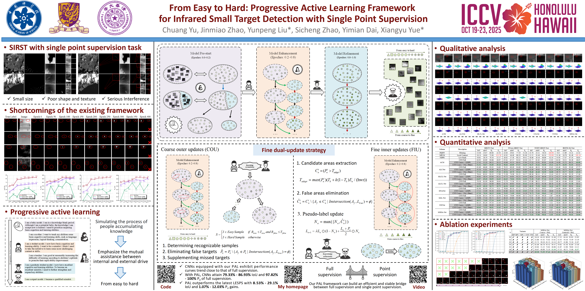

<div align="center">
  <h1 style="border-bottom: none;">From Easy to Hard: Progressive Active Learning Framework for Infrared Small Target Detection with Single Point Supervision</h1>
</div>

<div align="center">
  <p>
    <a href="https://yuchuang1205.github.io/" target="_blank">Chuang Yu</a><sup>1,2,5</sup>,&nbsp
    <a href="https://scholar.google.com/citations?user=3cBa6r4AAAAJ&hl=zh-CN" target="_blank">Jinmiao Zhao</a><sup>1,2</sup>,&nbsp
    <a>Yunpeng Liu</a><sup>1*</sup>,&nbsp
    <a href="https://scholar.google.com/citations?user=LJiQRJIAAAAJ&hl=zh-CN" target="_blank">Sicheng Zhao</a><sup>3</sup>,
    <br>
    <a href="https://scholar.google.com/citations?user=y5Ov6VAAAAAJ&hl=zh-CN&oi=ao" target="_blank">Yimian Dai</a><sup>4</sup>,&nbsp
    <a href="https://scholar.google.com/citations?user=-xQ-C1sAAAAJ&hl=zh-CN" target="_blank">Xiangyu Yue</a><sup>5*</sup>
  </p>
  <p>
    <sup>1</sup> Shenyang Institute of Automation, Chinese Academy of Sciences
     <br>
    <sup>2</sup> University of Chinese Academy of Sciences &nbsp;&nbsp;
     <br>
    <sup>3</sup> Tsinghua University &nbsp;&nbsp;
    <sup>4</sup> Nankai University &nbsp;&nbsp;
    <sup>5</sup> MMLab, The Chinese University of Hong Kong
  </p>
  
</div>
<p align="center">
  <a href="https://arxiv.org/abs/2412.11154"></a>
  <a href="https://yuchuang1205.github.io/"></a>
  <!-- <a href="#"></a> -->
  <!-- <a href="https://opensource.org/licenses/Apache-2.0"></a> -->
  <a href="#"></a>
  <a href="#"></a>
</p>

<p align="center">
  <a href="https://openaccess.thecvf.com/content/ICCV2025/html/Yu_From_Easy_to_Hard_Progressive_Active_Learning_Framework_for_Infrared_ICCV_2025_paper.html"><strong>Accepted by ICCV2025</strong></a>
</p>

<p align="center">
  <a href="https://zhuanlan.zhihu.com/p/1924197990941302819"><strong>知乎</strong></a>
  &nbsp;&nbsp;
  <a href="https://youtu.be/C7FUAGd0c6Q"><strong>YouTube</strong></a>
  &nbsp;&nbsp;
  <a href="https://github.com/YuChuang1205/PAL/blob/main/README_EN_WeChat.md"><strong>微信交流群</strong></a>
</p>

In this project demo, we have integrated More than ten SIRST detection networks ([**ACM**](https://arxiv.org/abs/2009.14530), [**ALCNet**](https://arxiv.org/abs/2012.08573), [**MLCL-Net**](https://doi.org/10.1016/j.infrared.2022.104107), [**ALCL-Net**](https://ieeexplore.ieee.org/document/9785618), [**DNANet**](https://arxiv.org/abs/2106.00487), [**GGL-Net**](https://ieeexplore.ieee.org/abstract/document/10230271), [**UIUNet**](https://arxiv.org/abs/2212.00968), [**MSDA-Net**](https://arxiv.org/abs/2406.02037), . . . ), label forms (**Full supervision**, **Coarse single-point supervision**, **Centroid single-point supervision**), and datasets ([**SIRST**](https://ieeexplore.ieee.org/document/9423171), [**NUDT-SIRST**](https://ieeexplore.ieee.org/document/9864119), [**IRSTD-1k**](https://ieeexplore.ieee.org/document/9880295) and [**SIRST3**](https://arxiv.org/pdf/2304.01484)). At the same time, more networks and functions can be integrated into the project later. We hope we can contribute to the development of this field. **We welcome everyone to integrate their networks into our project via pull request to build a collaborative ecosystem.** (欢迎大家将自己的网络以 pull request 集成到我们的项目中)

<p align="center">
  </br>
</p>  

<div align="center">
Comparison of different methods on the SIRST3 dataset. <i>CNN Full</i>, <i>CNN Coarse</i>, and <i>CNN Centroid</i> denote CNN-based methods under full supervision, coarse and centroid point supervision.
</div><br>

## 🔥 News 
-2026.07 🌸🌸 We **continue to support** more networks and **welcome pull requests** for integrating your networks.  
-2026.07 🌸🌸 We have adapted five more methods (**AGPCNet**, **HDNet**, **ISNet**, **SCTransNet**, **SFDTNet**).   
-2026.02 🌟🌟 We have created a **[WeChat group](https://github.com/YuChuang1205/PAL/blob/main/README_EN_WeChat.md)** for PAL discussion, support, and extension.   
-2025.12 🌟🌟 We have updated the paper (**PAL**) version on arXiv.  
-2025.06 🎉🎉 The paper (**PAL**) have been accepted by **ICCV 2025**.  
-2025.03 🌟🌟 We have released the **Complete Code**, supporting many networks ([**ACM**](https://arxiv.org/abs/2009.14530), [**ALCNet**](https://arxiv.org/abs/2012.08573), [**MLCL-Net**](https://doi.org/10.1016/j.infrared.2022.104107), [**ALCL-Net**](https://ieeexplore.ieee.org/document/9785618), [**DNANet**](https://arxiv.org/abs/2106.00487), [**GGL-Net**](https://ieeexplore.ieee.org/abstract/document/10230271), [**UIUNet**](https://arxiv.org/abs/2212.00968), [**MSDA-Net**](https://arxiv.org/abs/2406.02037)), three label forms (**Full supervision**, **Coarse single-point supervision**, **Centroid single-point supervision**), and many datasets ([**SIRST**](https://ieeexplore.ieee.org/document/9423171), [**NUDT-SIRST**](https://ieeexplore.ieee.org/document/9864119), [**IRSTD-1k**](https://ieeexplore.ieee.org/document/9880295) and [**SIRST3**](https://arxiv.org/pdf/2304.01484)).  
-2024.12 🌟🌟 We have released the **PAL manuscript**. 


<!--## The official complete code for paper "From Easy to Hard: Progressive Active Learning Framework for Infrared Small Target Detection with Single Point Supervision" [[Paper](https://openaccess.thecvf.com/content/ICCV2025/html/Yu_From_Easy_to_Hard_Progressive_Active_Learning_Framework_for_Infrared_ICCV_2025_paper.html)] [[**知乎**](https://zhuanlan.zhihu.com/p/1924197990941302819)]  [[YouTube](https://youtu.be/C7FUAGd0c6Q)] [[**微信交流群**](https://github.com/YuChuang1205/PAL/blob/main/README_EN_WeChat.md)] [Accepted by ICCV2025]-->

<!--
<div align="center">
In this project demo, we have integrated multiple SIRST detection networks (ACM, ALC, MLCL-Net, ALCL-Net, DNANet, GGL-Net, UIUNet, MSDA-Net), label forms (Full supervision, Coarse single-point supervision, Centroid single-point supervision), and datasets (SIRST, NUDT, IRSTD-1K and SIRST3). At the same time, more networks and functions can be integrated into the project later. We hope we can contribute to the development of this field.
</div><br>
-->

<!--In this project demo, we have integrated multiple SIRST detection networks ([**ACM**](https://arxiv.org/abs/2009.14530), [**ALCNet**](https://arxiv.org/abs/2012.08573), [**MLCL-Net**](https://doi.org/10.1016/j.infrared.2022.104107), [**ALCL-Net**](https://ieeexplore.ieee.org/document/9785618), [**DNANet**](https://arxiv.org/abs/2106.00487), [**GGL-Net**](https://ieeexplore.ieee.org/abstract/document/10230271), [**UIUNet**](https://arxiv.org/abs/2212.00968), [**MSDA-Net**](https://arxiv.org/abs/2406.02037)), label forms (**Full supervision**, **Coarse single-point supervision**, **Centroid single-point supervision**), and datasets ([**SIRST**](https://ieeexplore.ieee.org/document/9423171), [**NUDT-SIRST**](https://ieeexplore.ieee.org/document/9864119), [**IRSTD-1k**](https://ieeexplore.ieee.org/document/9880295) and [**SIRST3**](https://arxiv.org/pdf/2304.01484)). At the same time, more networks and functions can be integrated into the project later. We hope we can contribute to the development of this field.-->


<!--
<div align="center">
  Comparison of different methods on the SIRST3 dataset. CNN Full, CNN Coarse, and CNN Centroid denote CNN-based methods under full supervision, coarse and centroid point supervision. The curve trend of CNNs equipped with the PAL framework is basically consistent with that of full supervision, whereas CNNs with the LESPS framework is not. In addition, compared with the LESPS, using our PAL framework can improve by 8.53%-29.1% and 1.07%-12.03% in the IoU and Pd.
</div><br>
-->

## 🚀 Overview

We consider that an excellent learning process should be from easy to hard and take into account the learning ability of the current learner (model) rather than directly treating all tasks (samples) equally. Inspired by organisms gradually adapting to the environment and continuously accumulating knowledge, we first propose an innovative progressive active learning idea, which emphasizes that the network progressively and actively recognizes and learns more hard samples to achieve continuous performance enhancement. For details, please see [[Paper](https://openaccess.thecvf.com/content/ICCV2025/html/Yu_From_Easy_to_Hard_Progressive_Active_Learning_Framework_for_Infrared_ICCV_2025_paper.html)].
   
<p align="center">
  </br>
</p>


## Datasets
1. Original datasets
* **NUDT-SIRST** [[Original dataset](https://pan.baidu.com/s/1WdA_yOHDnIiyj4C9SbW_Kg?pwd=nudt)] [[paper](https://ieeexplore.ieee.org/document/9864119)]
* **SIRST** [[Original dataset](https://github.com/YimianDai/sirst)] [[paper](https://ieeexplore.ieee.org/document/9423171)]
* **IRSTD-1k** [[Original dataset](https://drive.google.com/file/d/1JoGDGF96v4CncKZprDnoIor0k1opaLZa/view)] [[paper](https://ieeexplore.ieee.org/document/9880295)]
* **SIRST3** [[Original dataset](https://github.com/XinyiYing/LESPS)] [[paper](https://arxiv.org/pdf/2304.01484)]

2. The labels are processed according to the "coarse_anno.m" and "centroid_anno.m" files in the "tools" folder to produce coarse point labels and centroid point labels. (**You can also skip this step and use the complete dataset in step 3 directly.**)

3. The datasets we created from original datasets (**can be used directly in our demo**)
     
* [💎 Download the dataset required by our code!!!](https://pan.baidu.com/s/1_QIs9zUM_7MqJgwzO2aC0Q?pwd=1234)  

  
## How to use our code
1. Download the dataset
   
&nbsp;&nbsp;&nbsp;&nbsp;&nbsp;&nbsp;&nbsp;&nbsp;Click [download datasets](https://pan.baidu.com/s/1_QIs9zUM_7MqJgwzO2aC0Q?pwd=1234) 

&nbsp;&nbsp;&nbsp;&nbsp;&nbsp;&nbsp;&nbsp;&nbsp;Unzip the downloaded compressed package to the root directory of the project.

2. Creat a Anaconda Virtual Environment

    ```
    conda create -n PAL python=3.8 
    conda activate PAL 
    ```
3. Configure the running environment
   
   ```
    pip install torch==1.13.1+cu116 torchvision==0.14.1+cu116 torchaudio==0.13.1 --extra-index-url https://download.pytorch.org/whl/cu116
    pip install segmentation_models_pytorch -i https://pypi.tuna.tsinghua.edu.cn/simple
    pip install PyWavelets -i https://pypi.tuna.tsinghua.edu.cn/simple
    pip install scikit-image -i https://pypi.tuna.tsinghua.edu.cn/simple
    pip install albumentations==1.3.0 -i https://pypi.tuna.tsinghua.edu.cn/simple
    pip install scikit-learn matplotlib thop h5py SimpleITK scikit-image medpy yacs torchinfo
    ```
4. Training the model  
   
    The default model, dataset and label forms are MSDA-Net, SIRST3, and coarse point labels. If you need to train others, please modify the corresponding setting in "train_model.py". Just change the settings to your choice. It's very simple. For details, please see the beginning of the code of "train_model.py".<br>
    ```
    python train_model.py
    ```
5. Testing the Model  
     
    The default model, dataset and label forms are MSDA-Net, SIRST3, and coarse point labels. If you need to test others, please modify the corresponding setting in "test_model.py". Notably, in the "test_model.py" file, you also need to assign the name of the folder where the weight file is located to the "test_dir_name" variable so that the program can find the corresponding model weights. For details, please see the beginning of the code of "test_model.py".
    ```
    python test_model.py
    ```
6. Performance Evaluation
    Use "cal_mIoU_and_nIoU.py" and "cal_PD_and_Fa.py" for performance evaluation. Notably, the corresponding folder path should be replaced. default：SIRST3.
    ```
    python cal_mIoU_and_nIoU.py
    python cal_PD_and_Fa.py
    ```
    
## Results  

* **Quantative Results on the SIRST3 dataset with Coarse point labels:**
<p align="center">
  
</p>  

* **Quantative Results on the three individual datasets with Coarse point labels:**
<p align="center">
  
</p>  
  
* **Quantative Results on the SIRST3 dataset with Centroid point labels:**
<p align="center">
  
</p>   

* **Quantative Results on the three individual datasets with Centroid point labels:**
<p align="center">
  
</p>  

* **Qualitative results on the SIRST3 dataset with Coarse point labels:** (Red denotes the correct detections, blue denotes the false detections, and yellow denotes the missed detections.)
<p align="center">
  
</p>  

* **Qualitative results on the SIRST3 dataset with Centroid point labels:** (Red denotes the correct detections, blue denotes the false detections, and yellow denotes the missed detections.)
<p align="center">
  
</p>  


## Citation

If you find this repo helpful, please give us a 🤩**star**🤩. Please consider citing the **PAL** if it benefits your project. <br>  

BibTeX reference is as follows.
```
@inproceedings{yu2025easy,
  title={From easy to hard: Progressive active learning framework for infrared small target detection with single point supervision},
  author={Yu, Chuang and Zhao, Jinmiao and Liu, Yunpeng and Zhao, Sicheng and Dai, Yimian and Yue, Xiangyu},
  booktitle={Proceedings of the IEEE/CVF International Conference on Computer Vision},
  pages={2588--2598},
  year={2025}
}
```

word reference is as follows.
```
Chuang Yu, Jinmiao Zhao, Yunpeng Liu, Sicheng Zhao, Yimian Dai, Xiangyu Yue. From Easy to Hard: Progressive Active Learning Framework for Infrared Small Target Detection with Single Point Supervision. In Proceedings of the IEEE/CVF International Conference on Computer Vision (ICCV), pp. 2588--2598, 2025.
```
## 💥 Poster 
<p align="center">
  </br>
</p> 

## 微信交流群（2026-02-21）
🚑🚑 为了方便解决大家在使用以及扩展本PAL开源框架中存在的问题，我建立了一个微信群聊，如下：(**若二维码过期，可以在github的问题区留言，我将及时更新~~~**)

<p align="center">
  </br>
</p> 

## Other link


1. My homepage: [[YuChuang](https://github.com/YuChuang1205)]
2. "MSDA-Net" demo (TGRS2025): [[Link](https://github.com/YuChuang1205/MSDA-Net)]
3. My "FDEP Framework" project code: [[Link](https://github.com/YuChuang1205/FDEP-Framework)]
